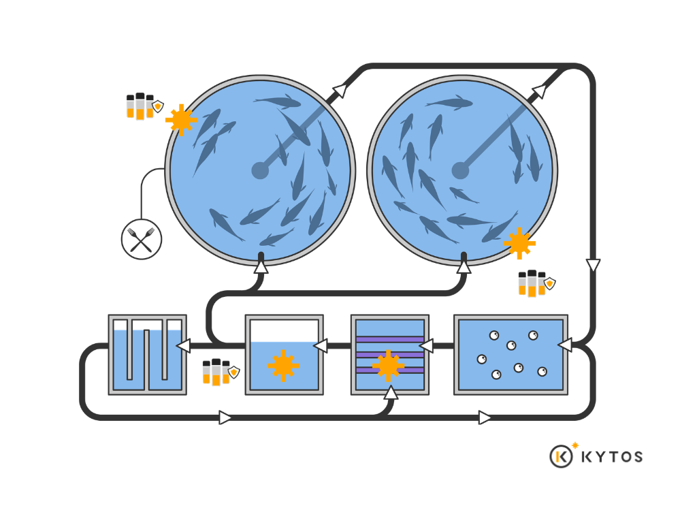

# Exploring pangasius RAS nursery systems: Microbial dynamics and rearing performance
## Overview of the FreshStudio RAS System and KYTOS microbial monitoring program
:::{.text-justify}
Pangasius larvae were reared in four recirculating aquaculture systems (RAS), including three DeltaRAS units (DeltaRAS1, DeltaRAS2, and DeltaRAS3), each consisting of ten 1m³ tanks, and one MiniRAS unit composed of nine 500L tanks. The recirculating systems were designed and installed by Fresh Studio (FreshRAS). All rearing tanks were located within a dedicated nursery facility, referred to as the MiniRAS room, where the tanks were interconnected and linked to a centralized recirculating filtration system engineered and operated by Fresh Studio.

During the early rearing stage, larvae were initially fed Artemia before gradually transitioning to formulated feeds (INVE 2/3 followed by INVE 3/5) according to their developmental stage.

Within the framework of this project, KYTOS was responsible for monitoring microbial dynamics in the water. Water samples were collected at seven day intervals to assess temporal changes in the microbial community across the nursery systems. Over the 35day rearing period, the collected dataset included microbial indicators, feed consumption, water quality parameters, as well as fish growth performance and survival rates. The results obtained from this monitoring program are presented in the following sections.
:::
{width="80%"}

## Results and Discussion
### Microbial parameters assessed via the Kytos monitoring system
::: hero
  <div class="grid" style="display:grid; grid-template-columns:1fr 1fr; gap:30px;">

<div>

```{r, echo=FALSE, warning=FALSE, message=FALSE}

library(ggplot2)
library(tidyr)

data_pro <- data.frame(
  Date = as.Date(c("2025-05-26",
                   "2025-06-02",
                   "2025-06-09",
                   "2025-06-16",
                   "2025-06-23")),

  Delta_Ras1 = c(76.05, 51.18, 48.06, 56.55, 36.75),
  Delta_Ras2 = c(55.61, 59.04, 56.55, 53.67, 55.71),
  Delte_Ras3 = c(59.21, 37.31, 49.45, 43.17, 57.4),
  Mini_Ras   = c(63.80, 61.63, 50.41, 45.47, 39.23)
)

data_pro <- pivot_longer(data_pro,
                          cols = -Date,
                          names_to = "System",
                          values_to = "Productivity")

ggplot(data_pro, aes(x = Date, y = Productivity, color = System)) +
  geom_line(linewidth = 1) +
  geom_point(size = 2) +
  labs(title = expression(bold("Productivity")),
       y = "(%)",
       x = "",
       color = NULL) +
  scale_y_continuous(limits = c(0, 80), breaks = seq(0, 80, 10)) +
  theme_minimal(base_size = 14) +
  theme(
    plot.title = element_text(face="bold", size=18),
    axis.text = element_text(color = "black", size = 12),
    axis.title = element_text(face="bold"),
    legend.position = "bottom",
    legend.title = element_text(face="bold"),
    panel.grid.major = element_blank()
  )

```
</div>

<div>
```{r, echo=FALSE, warning=FALSE, message=FALSE}

data_bac <- data.frame(
  Date = as.Date(c("2025-05-26",
                   "2025-06-02",
                   "2025-06-09",
                   "2025-06-16",
                   "2025-06-23")),

  Delta_Ras1 = c(1631253, 1007920, 1087307, 888693, 1134160),
  Delta_Ras2 = c(977787, 594213, 738453, 1538160, 1163533),
  Delte_Ras3 = c(723573, 1524507, 749253, 802853, 1242587),
  Mini_Ras   = c(689680, 640400, 522000, 468347, 303813)
)
data_bac <- pivot_longer(data_bac,
                         cols = -Date,
                         names_to = "System",
                         values_to = "Bacterial_load")

ggplot(data_bac, aes(x = Date, y = Bacterial_load, color = System)) +
  geom_line(linewidth = 1) +
  geom_point(size = 2) +
  labs(title = expression(bold("Bacterial load")),
       y = "(cells/mL)",
       x = "",
       color = NULL) +
  scale_y_continuous(limits = c(0, 1800000), breaks = seq(0, 1800000, 200000)) +
  theme_minimal(base_size = 14) +
  theme(
    plot.title = element_text(face="bold", size = 18),
    axis.text = element_text(color = "black", size = 12),
    axis.title = element_text(face="bold"),
    legend.position = "bottom",
    panel.grid.major = element_blank()
  )

```
</div>

<div>
```{r, echo=FALSE, warning=FALSE, message=FALSE}

data_cell <- data.frame(
  Date = as.Date(c("2025-05-26",
                   "2025-06-02",
                   "2025-06-09",
                   "2025-06-16",
                   "2025-06-23")),
  
  Delta_Ras1 = c(78.03, 53.32, 47.03, 59.37, 19.11),
  Delta_Ras2 = c(59.18, 59.22, 36.58, 44.88, 44.08),
  Delte_Ras3 = c(59.43, 39.58, 45.99, 57.17, 39.38),
  Mini_Ras   = c(67.85, 64.85, 47.90, 57.17, 36.95)
)

data_cell <- pivot_longer(data_cell,
                          cols = -Date,
                          names_to = "System",
                          values_to = "Cell_viability")

ggplot(data_cell, aes(x = Date, y = Cell_viability, color = System)) +
  geom_line(linewidth = 1) +
  geom_point(size = 2) +
  labs(title = expression(bold("Cell viability")),
       y = "(%)",
       x = "",
       color = NULL) +
  scale_y_continuous(limits = c(0, 80), breaks = seq(0, 80, 10)) +
  theme_minimal(base_size = 14) +
  theme(
    plot.title = element_text(face= "bold", size = 18),
    axis.text = element_text(color = "black", size = 12),
    axis.title = element_text(face="bold"),
    legend.position = "bottom",
    panel.grid.major = element_blank()
  )

```
</div>

<div>
```{r, echo=FALSE, warning=FALSE, message=FALSE}

data_div <- data.frame(
  Date = as.Date(c("2025-05-26",
                   "2025-06-02",
                   "2025-06-09",
                   "2025-06-16",
                   "2025-06-23")),

  Delta_Ras1 = c(2018, 3429, 3592, 3217, 4030),
  Delta_Ras2 = c(3442, 3292, 3623, 3430, 3690),
  Delte_Ras3 = c(3586, 2852, 3586, 3352, 3359),
  Mini_Ras   = c(2713, 3355, 3637, 3571, 3708)
)

data_div <- pivot_longer(data_div,
                         cols = -Date,
                         names_to = "System",
                         values_to = "Diversity")

ggplot(data_div, aes(x = Date, y = Diversity, color = System)) +
  geom_line(linewidth = 1) +
  geom_point(size = 2) +
  labs(title = expression(bold("Diversity")),
       y = "",
       x = "",
       color = NULL) +
  scale_y_continuous(limits = c(0, 4000), breaks = seq(0, 4000, 500)) +
  theme_minimal(base_size = 14) +
  theme(
    plot.title = element_text(face= "bold", size = 18),
    axis.text = element_text(color = "black", size = 12),
    axis.title = element_text(face="bold"),
    legend.position = "bottom",
    panel.grid.major = element_blank()
  )

```
</div>
</div>
:::

::: {.text-justify}
The microbial indicators showed clear differences among systems throughout the culture cycle. The Bacterial Load profile revealed marked divergence between systems. The DeltaRAS systems (1, 2, and 3) exhibited pronounced fluctuation peaks during the culture period, particularly in the mid and late stages. In contrast, MiniRAS displayed a gradual decreasing trend and maintained a lower fluctuation amplitude toward the end of the cycle. Overall, the variation in bacterial density was more stable in MiniRAS compared to the DeltaRAS systems.

Regarding Diversity, all four systems showed a slight increasing trend over time without abrupt declines; however, DeltaRAS1 exhibited more pronounced temporal variability compared to DeltaRAS2 and MiniRAS.

Cell Viability tended to decrease toward the end of the culture cycle in most systems. DeltaRAS1 recorded the most evident decline, particularly in the late stage. DeltaRAS2 and DeltaRAS3 showed reductions during the mid-cycle, followed by slight recovery before stabilizing. MiniRAS exhibited a gradual decline over time without pronounced fluctuation peaks.

In terms of Productivity, DeltaRAS2 maintained the most stable levels throughout the culture period, whereas DeltaRAS1 and DeltaRAS3 displayed stage-dependent variations. MiniRAS showed a decreasing trend over time, consistent with the pattern observed for Cell Viability.

Overall, MiniRAS and DeltaRAS2 demonstrated lower microbial variability and more stable temporal dynamics, whereas DeltaRAS1 and DeltaRAS3 exhibited greater fluctuation amplitudes across multiple microbial indicators.
:::

### Relationship between feed input and microbial indicators
::: hero
  <div class="grid" style="display:grid; grid-template-columns:1fr 1fr; gap:30px;">
  
<div>
```{r, echo=FALSE, warning=FALSE, message=FALSE}


data_feed <- data.frame(
  Date = as.Date(c("2025-05-26",
                   "2025-06-02",
                   "2025-06-09",
                   "2025-06-16",
                   "2025-06-23")),

  Artemia  = c(340.5, 1120, 150, 0, 0),
  `INVE 2/3` = c(0, 120, 0, 0, 0),
  `INVE 3/5` = c(0, 120, 300, 300, 400)
)

data_feed <- pivot_longer(data_feed,
                          cols = -Date,
                          names_to = "Feed",
                          values_to = "Gram")

ggplot(data_feed, aes(x = Date, y = Gram, fill = Feed)) +
  geom_bar(stat = "identity") +
  labs(title = expression(bold("DeltaRAS 1")),
       y = "Gram",
       x = "",
       fill = NULL) +
  theme_minimal(base_size = 14) +
  theme(
    plot.title = element_text(face="bold", size = 18),
    axis.text = element_text(color = "black", size = 12),
    axis.title = element_text(face = "bold"),
    legend.position = "bottom",
    panel.grid.major = element_blank()
  )

```
</div>

<div>
```{r, echo=FALSE, warning=FALSE, message=FALSE}

data_feed2 <- data.frame(
  Date = as.Date(c("2025-05-26",
                   "2025-06-02",
                   "2025-06-09",
                   "2025-06-16",
                   "2025-06-23")),

  Artemia    = c(681, 2328, 150, 150, 0),
  `INVE 2/3` = c(0, 156, 0, 0, 0),
  `INVE 3/5` = c(0, 0, 192, 252, 392)
)

data_feed2 <- pivot_longer(data_feed2,
                           cols = -Date,
                           names_to = "Feed",
                           values_to = "Gram")

ggplot(data_feed2, aes(x = Date, y = Gram, fill = Feed)) +
  geom_bar(stat = "identity") +
  labs(title = "DeltaRAS 2",
       y = "Gram",
       x = "",
       fill = NULL) +
  theme_minimal(base_size = 14) +
  theme(
    plot.title = element_text(size = 18, face = "bold"),
    axis.text = element_text(color = "black", size = 12),
    axis.title = element_text(face = "bold"),
    legend.position = "bottom",
    panel.grid.major = element_blank()
  )

```
</div>

<div>
```{r, echo=FALSE, warning=FALSE, message=FALSE}

data_feed3 <- data.frame(
  Date = as.Date(c("2025-05-26",
                   "2025-06-02",
                   "2025-06-09",
                   "2025-06-16",
                   "2025-06-23")),

  Artemia    = c(681, 1440, 210, 0, 0),
  `INVE 2/3` = c(0, 136, 0, 0, 0),
  `INVE 3/5` = c(0, 136, 396, 396, 396)
)

data_feed3 <- pivot_longer(data_feed3,
                           cols = -Date,
                           names_to = "Feed",
                           values_to = "Gram")

ggplot(data_feed3, aes(x = Date, y = Gram, fill = Feed)) +
  geom_bar(stat = "identity") +
  labs(title = "DeltaRAS 3",
       y = "Gram",
       x = "",
       fill = NULL) +
  theme_minimal(base_size = 14) +
  theme(
    plot.title = element_text(size = 18, face = "bold"),
    axis.text = element_text(color = "black", size = 12),
    axis.title = element_text(face = "bold"),
    legend.position = "bottom",
    panel.grid.major = element_blank()
  )

```
</div>

<div>
```{r, echo=FALSE, warning=FALSE, message=FALSE}

data_feed4 <- data.frame(
  Date = as.Date(c("2025-05-26",
                   "2025-06-02",
                   "2025-06-09",
                   "2025-06-16",
                   "2025-06-23")),

  Artemia    = c(237.3, 1344, 0, 0, 0),
  `INVE 2/3` = c(0, 112, 0, 0, 0),
  `INVE 3/5` = c(0, 112, 420, 504, 700)
)

data_feed4 <- pivot_longer(data_feed4,
                           cols = -Date,
                           names_to = "Feed",
                           values_to = "Gram")

ggplot(data_feed4, aes(x = Date, y = Gram, fill = Feed)) +
  geom_bar(stat = "identity") +
  labs(title = "MiniRAS",
       y = "Gram",
       x = "",
       fill = NULL) +
  theme_minimal(base_size = 14) +
  theme(
    plot.title = element_text(size = 18, face = "bold"),
    axis.text = element_text(color = "black", size = 12),
    axis.title = element_text(face = "bold"),
    legend.position = "bottom",
    panel.grid.major = element_blank()
  )

```
</div>

</div>
:::

::: {.text-justify}
Observation of the graphs suggests that the period when commercial feed INVE was first introduced in combination with Artemia may have contributed to changes in microbial indicators. Commercial feed contains a relatively stable protein composition and different proportions of carbohydrates and lipids compared with live artemia, which can alter the form and rate at which dissolved compounds are released into the water.

The graphs show fluctuations with an increase in Bacterial Load in the DeltaRAS systems, while Diversity also tends to increase. This pattern indicates that the microbial community is responding to the introduction of a new substrate source. According to Rurangwa and Verdegem (2015), changes in feed type can modify the composition of dissolved organic compounds and metabolic by products in aquaculture systems, thereby influencing the structure of microbial communities. Allison and Martiny (2008) further suggested that when a new substrate source emerges or the nutritional spectrum changes, microbial communities tend to increase their functional diversity through niche differentiation.

In recirculating aquaculture systems (RAS), such changes may not only affect heterotrophic bacterial groups but can also indirectly influence nitrification processes in the biofilter. Differences in protein content and digestibility between Artemia and commercial feed may alter the dynamics of ammonia excretion by fish, thereby affecting the substrate supply for ammonia oxidizing bacteria (AOB). When the rate or concentration of ammonia input fluctuates, the activity of nitrifying communities within the biofilm may adjust accordingly, leading to a rebalancing between AOB and nitrite oxidizing bacteria (NOB). These adjustments may contribute to the temporary fluctuations in Bacterial Load, Cell Viability, and Productivity observed during the feed transition period.

The increase in Diversity suggests that the microbial community is not dominated by a single group but is instead expanding its community structure to more effectively utilize newly available nutrient sources. Higher diversity is often associated with greater ecological stability and a stronger capacity to maintain ecosystem functions under environmental changes (Shade et al., 2012). This is particularly important in RAS, where the balance between heterotrophic bacteria and nitrifying microorganisms plays a critical role in determining the efficiency of nitrogen transformation processes.

:::

### Temporal variation of environmental parameters and their association with microbial indicators

```{r, echo=FALSE, warning=FALSE, message=FALSE}

library(knitr)
library(kableExtra)

water_quality <- data.frame(
  Date = as.Date(c(
    "2025-05-26","2025-06-02","2025-06-09","2025-06-16","2025-06-23",
    "2025-05-26","2025-06-02","2025-06-09","2025-06-16","2025-06-23",
    "2025-05-26","2025-06-02","2025-06-09","2025-06-23",
    "2025-05-26","2025-06-02","2025-06-09","2025-06-16","2025-06-23"
  )),
  
  System = c(
    rep("DeltaRAS 1",5),
    rep("DeltaRAS 2",5),
    rep("DeltaRAS 3",4),
    rep("MiniRAS",5)
  ),
  
  Notes = c(
    "",
    "add 280g Acid citric",
    "Chlorine detected (due to Chlorinated mains water)",
    "add 180g NaHCO3 + 450g Na2CO3, exchange 10%",
    "",
    
    "",
    "Add 11kg NaCl",
    "Chlorine detected (due to Chlorinated mains water)",
    "",
    "",
    
    "",
    "add 280g Acid citric",
    "Chlorine detected (due to Chlorinated mains water)",
    "",
    
    "",
    "",
    "add oxygen with air pump",
    "add 52.8g NaHCO3 + 133g Na2CO3",
    ""
  ),
  
  DO_mgL = c(2.53,4.24,3.04,2.63,2.89,
             3.85,3.57,3.74,2.83,2.55,
             3.22,2.90,3.29,3.87,
             2.81,3.30,1.81,2.68,2.10),
  
  pH = c(7.8,8.0,7.4,7.2,7.8,
         8.0,7.6,7.6,6.6,7.8,
         8.0,7.2,7.6,8.5,
         8.1,7.6,7.0,6.6,6.3),
  
  Temperature = c(28.5,28.4,28.1,28.6,27.8,
                  28.4,28.8,28.1,29.0,27.9,
                  28.5,29.2,28.3,28.1,
                  28.7,28.6,28.0,29.3,27.9),
  
  TAN = c(0.0,5.0,0.5,1.0,0.5,
          0.0,0.5,0.5,1.0,0.6,
          0.0,-4.0,0.5,0.3,
          0.0,0.5,0.5,0.5,2.0),
  
  NH3 = c(0.00000,0.35000,0.00925,0.01180,0.02120,
          0.00000,0.01455,0.01455,0.00300,0.02332,
          0.00000,-0.05000,0.01455,0.05760,
          0.00000,0.01455,0.00350,0.00160,0.00280),
  
  NO2 = c(0,5,5,5,7,
          2,5,8,5,7,
          1,5,3,0,
          0,0.5,0.5,0.5,0),
  
  NO3 = c(0,50,100,100,100,
          50,100,100,100,100,
          0,150,100,20,
          0,25,25,50,100)
)

kable(water_quality,
      align = "c") %>%
  kable_styling(
    full_width = TRUE,
    position = "left",
    bootstrap_options = c("striped", "condensed", "responsive")
  ) %>%
  row_spec(0, background = "black", color = "white") %>%
  column_spec(1, width = "110px", extra_css = "white-space: nowrap;") %>%
  column_spec(2, width = "110px", extra_css = "white-space: nowrap;")

```

::: {.text-justify}
Overall, the measured environmental parameters across the systems showed a certain degree of temporal variation but remained within ranges commonly observed in recirculating aquaculture systems. Parameters such as dissolved oxygen (DO), pH, and temperature remained relatively stable between sampling events, whereas dissolved nitrogen compounds (TAN, NH₃, NO₂⁻, and NO₃⁻) exhibited some variation among systems and sampling times. These fluctuations reflect changes in environmental conditions during system operation and may influence the functional state of microbial communities in the water.

In the DeltaRAS systems, variations in microbial indicators may be associated with changes in intermediate nitrogen compounds involved in the nitrification process, particularly NH₃ and NO₂⁻. In DeltaRAS1, NH₃ increased markedly during the early phase of the production cycle and coincided with fluctuations in Bacterial Load and a decrease in Cell Viability. This pattern may reflect a stage in which the microbial community had not yet reached functional equilibrium, where ammonia accumulated faster than it could be oxidized by ammonia oxidizing bacteria (AOB). According to Prosser (1989), AOB generally exhibit relatively slow growth rates and are sensitive to environmental conditions; therefore, when NH₃ increases abruptly, the microbial community may experience a temporary substrate overload before nitrification becomes more stable.

In contrast, in DeltaRAS2, NO₂⁻ concentrations increased and persisted longer compared with the other systems. The accumulation of nitrite suggests that the oxidation of ammonia occurred, but the subsequent conversion of NO₂⁻ to NO₃⁻ did not proceed at the same rate, indicating an imbalance between ammonia oxidizing bacteria (AOB) and nitrite oxidizing bacteria (NOB). According to Wiesmann (1994), nitrite accumulation commonly occurs when the NOB population has not yet fully developed or is inhibited by environmental conditions. The pronounced fluctuations in Bacterial Load and Productivity observed during this period may indicate that the microbial community was adjusting its structure and metabolic activity to re-establish balance within the nitrification cycle. As the concentrations of intermediate nitrogen compounds gradually decreased, microbial indicators also became more stable, suggesting that the system had reached a more balanced biological state.
:::

### Growth performance and survival during the nursery cycle

```{r, echo=FALSE, warning=FALSE, message=FALSE}

data_compare <- data.frame(
  System = c("Delta", "Mini"),
  Average_Weight = c(0.264, 0.32),
  SGR = c(17.44, 18.00)
)
ggplot(data_compare, aes(x = System)) +
  # Average Weight
  geom_col(aes(y = Average_Weight, fill = "Average Weight"),
           width = 0.5) +
  # SGR (map scale)
  geom_col(aes(y = (SGR - 17.1) * 0.10 + 0.23,
               fill = "SGR"),
           width = 0.5,
           alpha = 0.8) + 
  scale_y_continuous(
    name = "Gram",
    breaks = seq(0.23, 0.33, 0.01),
    sec.axis = sec_axis(
      trans = ~ (.-0.23)/0.10 + 17.1,
      name = "SGR (%)",
      breaks = seq(17.1, 18.1, 0.1)
    )
  ) +
  coord_cartesian(ylim = c(0.23, 0.33)) +
  scale_fill_manual(values = c("Average Weight" = "#f5a",
                               "SGR" = "#f5a000")) +
  labs(title = "", x = "") +
  theme_minimal(base_size = 14) +
  theme(
    plot.title = element_text(size = 22, face = "bold"),
    legend.position = "bottom",
    legend.title = element_blank(),
    panel.grid.major.x = element_blank()
  )

```

::: {.text-justify}
After the 30 day nursery cycle, the MiniRAS system showed higher growth performance and survival rates compared with the average values observed in the DeltaRAS systems. The difference in growth and survival between the two systems may be related to the level of stability of the microbial community throughout the culture period. The MiniRAS system exhibited a tendency to maintain a relatively more stable Bacterial Load, with Cell Viability showing fewer fluctuations and Diversity remaining relatively balanced over time.

In RAS, microorganisms play a central role in nitrogen transformation processes and organic matter degradation. When microbial abundance and activity are maintained in a stable state, processes such as nitrification can proceed more continuously, thereby reducing the accumulation of ammonia and nitrite, which are known to cause physiological stress and negatively affect growth performance (Schreier et al., 2010; Blancheton et al., 2013). In addition, microbial communities with higher diversity are generally more resilient and capable of recovering from environmental disturbances (Allison & Martiny, 2008; Shade et al., 2012). The relatively stable Diversity observed in the MiniRAS system may therefore be associated with the higher growth performance and survival rates recorded in this system.

Although no regression analysis or modeling has been conducted to verify a direct causal relationship, the consistent trend between microbial stability and improved growth performance suggests that a balanced microbial community may contribute to more stable environmental conditions for the cultured fish. However, other factors such as system management practices and operational conditions may also play important roles and should be considered in future studies.
:::

# Conclusion
:::{.text-justify}
The results indicate differences in microbial dynamics among the RAS systems, which were characterized by varying levels of environmental stability and organic loading. Indicators such as Bacterial Load, Cell Viability, Diversity, and Productivity clearly reflected the biological fluctuations occurring within the systems throughout the culture cycle. Variations in these indicators may correspond with changes in feeding regimes as well as environmental factors such as NH₃ and NO₂⁻.

Simultaneous monitoring of microbial indicators can provide complementary information for system management, particularly for optimizing feeding strategies and controlling organic loading. Integrating microbial monitoring into operational practices therefore has the potential to enhance the stability and performance of RAS systems in aquaculture applications.
:::