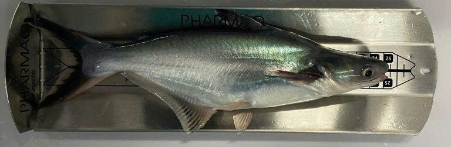
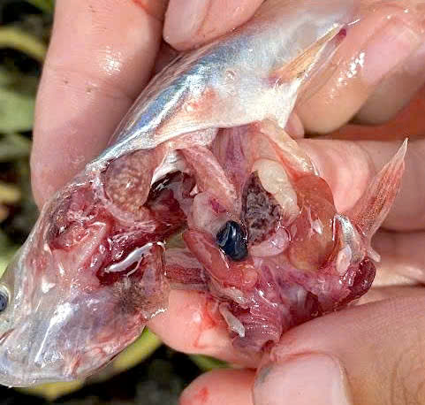
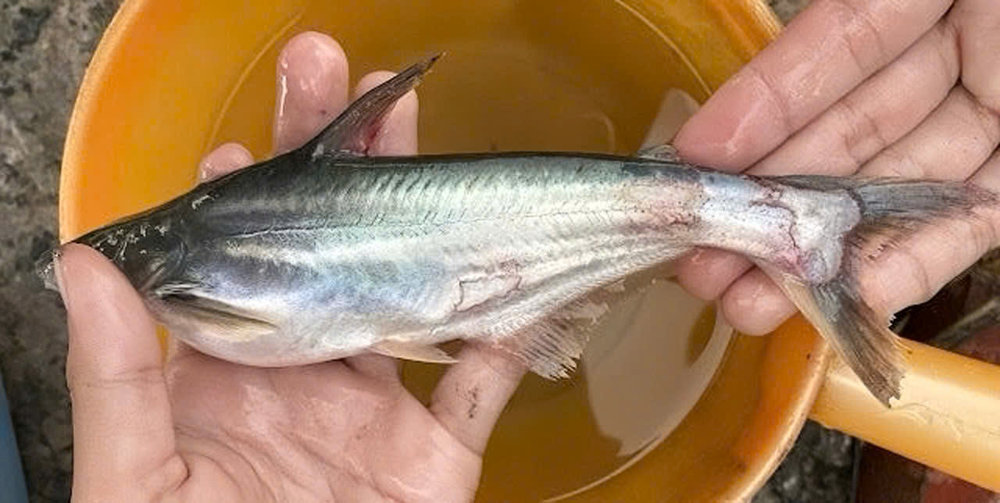
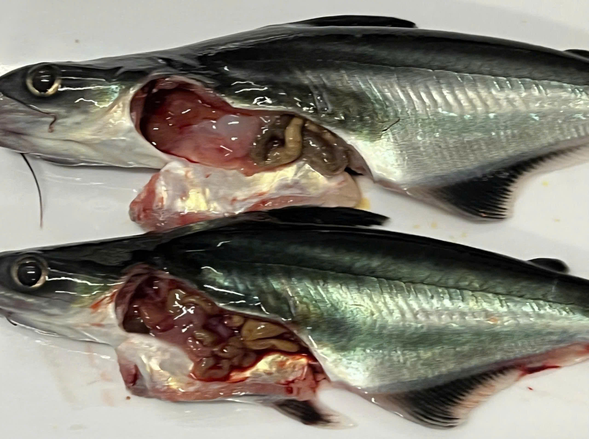

# Microbial diseases in pangasius
{fig-align="center" width=100% height=350px style="border-radius:12px;"}

::: text-justify
The most common bacterial diseases of striped catfish are hemorrhagic disease caused by Aeromonas hydrophila and bacillary necrosis of Pangasius (BNP) caused by Edwardsiella ictaluri (Dung et al 2008; Pokhrel & Oanh 2021). At the genus level, Aeromonas and Edwardsiella were detected in the sediment, but their relative abundances were low in water (0.032 and 0.073% of the total reads, respectively). Aeromonas had 0.45% relative abundance in the sediment. Another pathogen, Flavobacterium columnare, had a relative abundance of 1.02% in the pond water and 0.1% in sediment. This pathogen is the aetiological agent causing white patch disease in farmed catfish P. hypophthalmus fingerlings, leading to high mortality rates in commercial hatcheries and ponds in the Mekong Delta. Unfortunately, the OTUs at species level of these pathogenic bacteria were unassigned in this study (Truong et al., 2022).
:::

## Bacillary Necrosis of Pangasius (BNP) - Edwardsiella ictaluri
::::::::: {.columns}
::: {.column width="45%"}
{width="95%" style="margin: 0 auto; display: block;"}
:::
::: {.column width="50%"}
Bacillary necrosis of pangasius (BNP) is a severe systemic bacterial disease affecting *Pangasianodon hypophthalmus*, characterized by multifocal granulomatous lesions and necrosis in internal organs such as the liver, kidney, and spleen. The causal agent, *Edwardsiella ictaluri*, has been repeatedly isolated from affected tissues, and its involvement in BNP has been confirmed through both field observations and experimental infections (Crumlish et al., 2010; Huyen & Oanh, 2019). Histopathological analyses of naturally and experimentally infected fish reveal hallmark features of the disease, including congestion, hemorrhage, and necrosis across hepatic and renal tissues, as well as increased pigmented macrophage centers in the kidney and spleen (Huyen & Oanh, 2019). Experimental challenge studies further demonstrate that immersion or injection of *E. ictaluri* induces clinical signs similar to those seen in natural outbreaks, confirming the pathogen’s role in BNP and its ability to be transmitted horizontally among fish (Crumlish et al., 2010; Van & Hasan, 2020).
:::
:::::::::

## Motile Aeromonas Septicaemia (MAS) - *Aeromonas spp.*
::::::::: {.columns}
::: {.column width="50%"}
Motile Aeromonas septicaemia (MAS) is a widespread bacterial disease in pangasius aquaculture, primarily caused by *Aeromonas hydrophila* and related *Aeromonas* species (Crumlish et al., 2010; Sarker & Faruk, 2016). These Gram negative, opportunistic pathogens are naturally present in freshwater environments but can proliferate rapidly under intensive farming conditions, particularly when water quality is poor and organic loading is high due to uneaten feed and fish waste (Crumlish et al., 2010). Experimental infection studies have demonstrated that *A. hydrophila* induces typical clinical signs in striped catfish (*Pangasianodon hypophthalmus*), including external haemorrhages, hemorrhagic lesions, fin erosion, abdominal distension, and systemic septicaemia, leading to significant mortality in both juvenile and grow out fish (Crumlish et al., 2010; Sarker & Faruk, 2016). 
:::
::: {.column width="50%"}
{width="95%" style="margin: 0 auto; display: block;"}
:::
:::{.text-justify}
The occurrence of MAS is closely associated with intensive aquaculture practices, where high bacterial densities in pond water and sediments increase infection pressure on cultured fish (Sarker & Faruk, 2016). In Vietnamese pangasius farms, *A. hydrophila* is frequently isolated from outbreaks of haemorrhagic septicaemia, and the emergence of antibiotic resistant strains has further complicated disease management (Dang et al., 2021). Consequently, alternative control strategies such as bacteriophage therapy, including the use of phage PVN02, have shown promising results in reducing mortality under experimental conditions, highlighting the need for sustainable approaches beyond antibiotics in the control of MAS (Dang et al., 2021).
:::
:::::::::

## Columnaris Disease - *Flavobacterium columnare*
:::{.text-justify}
Columnaris disease, caused by *Flavobacterium columnare*, is an emerging bacterial disease in farmed striped catfish (*Pangasianodon hypophthalmus*) and a significant health problem in freshwater aquaculture worldwide. *F. columnare* is a Gram negative bacterium that primarily infects the skin, gills, and fins, producing characteristic white to yellowish lesions, tissue erosion, and surface necrosis, which may result in rapid mortality under warm, nutrient rich conditions (Declercq et al., 2013). The first confirmed report of *F. columnare* infection in pangasius was provided by Tien et al. (2012), who identified the pathogen using bacteriological and molecular methods. Disease outbreaks are commonly associated with elevated water temperatures, high stocking densities, and poor water quality conditions frequently encountered in intensive pangasius pond systems (Tien et al., 2012; Declercq et al., 2013). In addition, the ability of *F. columnare* to adhere to host tissues and form biofilms contributes to its persistence in pond environments and complicates disease control, highlighting the important role of environmental microbiomes in facilitating disease transmission in pangasius aquaculture (Declercq et al., 2013).
:::

## Fungal and Oomycete Infections - *Saprolegnia* and Filamentous Fungi
:::{.text-justify}
Fungal and oomycete infections represent an additional microbiological threat in pangasius culture, particularly during early life stages such as fry and fingerlings (Rathod et al., 2022; Thy et al., 2020). Among these pathogens, saprolegniosis caused by *Saprolegnia parasitica* is one of the most important fungal diseases affecting freshwater fish, including striped catfish (*Pangasianodon hypophthalmus*). *Saprolegnia* species are ubiquitous aquatic oomycetes that primarily infect the skin, gills, fins, and eggs, often colonizing stressed or mechanically damaged tissues and producing characteristic cotton like growths that can lead to severe mortality. Fungal outbreaks are commonly associated with unfavorable environmental conditions such as fluctuating temperatures, poor water quality, high organic loads, and inadequate pond hygiene (Rathod et al., 2022). In addition to *Saprolegnia*, studies in Vietnam have reported the isolation of various filamentous fungi, including *Fusarium*, *Aspergillus*, *Achlya*, and *Mucor*, from diseased pangasius fry and fingerlings, highlighting the diversity of fungal agents present in intensive pond systems (Thy et al., 2020). These fungal infections not only cause direct tissue damage but may also facilitate secondary bacterial infections, resulting in increased disease severity and economic losses in pangasius aquaculture where sanitation and biosecurity measures are insufficient (Thy et al., 2020).
:::

## Protozoan Parasitic Infections - *Ichthyophthirius multifiliis*
::::::::: {.columns}
::: {.column width="45%"}
{width="95%" style="margin: 0 auto; display: block;"}
:::

::: {.column width="50%"}
Protozoan parasitic infections also contribute to disease outbreaks in pangasius aquaculture systems. Among these parasites, *Ichthyophthirius multifiliis*, a ciliated protozoan and the etiological agent of ichthyophthiriasis, is one of the most common pathogens affecting freshwater fish, including striped catfish (*Pangasianodon hypophthalmus*) (Tien et al., 2012; Kumar et al., 2022). The parasite primarily infects the skin and gills, forming characteristic white cysts that impair respiration and induce severe physiological stress in infected fish (Kumar et al., 2022). Although *I. multifiliis* is not host specific to pangasius, outbreaks have been frequently associated with intensive freshwater catfish farming systems, particularly under conditions of unstable water quality and high stocking densities. 
:::
:::{.text-justify}
Protozoan infestations often predispose fish to secondary bacterial infections, most notably motile Aeromonas septicaemia caused by *Aeromonas hydrophila*, resulting in co infection scenarios that significantly increase mortality and economic losses compared to single pathogen infections (Kumar et al., 2022).
:::
:::::::::

## Opportunistic bacterial pathogens in pond environments
::: {.text-justify}
Intensive pangasius ponds harbor diverse bacterial communities, among which opportunistic pathogens such as *Aeromonas*, *Edwardsiella*, and *Flavobacterium* can proliferate when environmental conditions deteriorate. Studies using high throughput sequencing have revealed that bacterial diversity in pond water and sediments includes multiple genera with pathogenic potential, indicating that disease outbreaks often involve shifts in the microbial community rather than a single agent (Truong et al., 2022). These pond microbiomes influence pathogen persistence, biofilm formation on surfaces, and disease dynamics, linking microbial ecology directly to fish health.
:::

## Indirect effects of Harmful Algal Blooms (HABs) on fish disease susceptibility
::: {.text-justify}
Although harmful algal blooms (HABs) such as cyanobacterial proliferations do not directly infect fish, they exert significant indirect impacts on fish health by altering water quality and microbial community structure in aquaculture ponds. HAB events can lead to hypoxia, release of algal toxins, and disruption of water chemistry, which stress fish and compromise immune defenses. These environmental stresses create favorable conditions for bacterial pathogens to invade, increasing susceptibility to diseases like MAS and BNP. Broad ecological studies have established that HABs are critical environmental factors that interact with microbial pathogens to exacerbate disease outbreaks in freshwater fish farming systems globally.
:::

:::hero
  

:::
