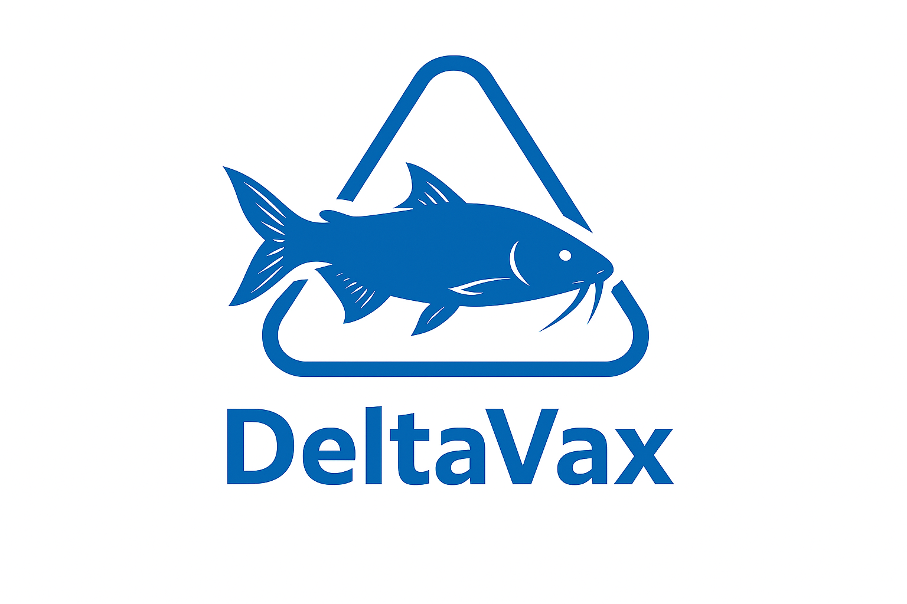

<!--title page-->
  <!--top-->
  
::: hero_title

 <div style="text-align: center; margin-top: 40px;">

  <h2 style="color:#F4A300; font-weight:700;">
A Review of Microbiomes in
  </h2>

  <h1 style="font-weight:800; margin-bottom:40px;">
Pangasius Aquaculture Systems
  </h1>
  <!--body-->
  
::: hero
  

</div>
:::

:::{.text-center}
### ***DeltaVax: Pioneering sustainable aquaculture development in the Mekong Delta***

### ***DeltaVax: Transforming the Mekong Delta Pangasius Chain***

DeltaVax is an innovative initiative designed to strengthen and transform the pangasius value chain as well as the broader aquaculture sector in the Mekong Delta, Vietnam. The project is funded by the Impact Clusters subsidy scheme of the Netherlands, which supports private-sector development in developing countries. Through this program, companies, research institutes, trade organizations, and NGOs collaborate in a consortium to share knowledge, expertise, and technology, aiming to promote inclusive economic growth, sustainable aquaculture practices, and improved working standards across the sector.


:::

:::{.text-justify}

## Project Summary

The **DeltaVax** project aims to significantly enhance knowledge, technical skills, and access to modern technologies within Vietnam’s aquaculture sector. The main objectives include:

* **Capacity Building:**

Establishing a “train the trainers” program together with coaching services to improve the expertise of Vietnamese aquaculture farmers, enabling them to acquire the skills required for modern aquaculture practices.

* **Technological Access:**

Facilitating access for Vietnamese farmers to advanced technologies such as **aquatic vaccines, qPCR disease diagnostic tools**, and modern **water treatment solutions.**

* **Water Quality Management:**

Emphasizing the role of microbial communities and strategies to maintain ecological balance in aquaculture ponds.

* **Innovation and Sustainability:**

Introducing innovative technologies such as **Recirculating Aquaculture Systems (RAS)** to promote sustainable aquaculture practices.

* **Fish Health and Welfare:**

Improving vaccination practices in the aquaculture sector in order to reduce disease outbreaks and minimize the use of chemicals and antibiotics.

***The DeltaVax project is a groundbreaking initiative that aims to pave the way for a sustainable and thriving pangasius aquaculture sector in the Mekong Delta.***

## <span style="color:#f5a000;"><strong> About KYTOS</strong></span>

**KYTOS** is a pioneering microbiome technology company that develops advanced solutions for microbial community management across multiple sectors, including aquaculture and agriculture. KYTOS applies modern flow cytometry technology to analyze and monitor microorganisms at the single cell level. This technology enables the rapid scanning of hundreds of thousands of microbial cells within minutes, using fluorescent staining techniques to generate a comprehensive quantitative profile of microbial load, diversity, and key microbial health indicators. Within the framework of the DeltaVax project, KYTOS is involved in monitoring the dynamics of microbial communities in pangasius recirculating aquaculture systems (RAS).
:::
:::{layout-ncol="2"}

{width="100%"}

{width="100%"}

:::

## Website Objectives
:::{.text-justify}
This website developed by KYTOS, is designed as a specialized knowledge repository designed to provide reliable information on the pangasius aquaculture sector in Vietnam. Its primary objective is to compile scientific literature, research findings, and practical knowledge into a comprehensive platform that enables readers to gain a clear understanding of the industry’s current status, development trends, challenges, and opportunities. The content is presented in an academic yet accessible manner, making it suitable for a wide audience, including researchers, students, technical specialists, industry stakeholders, and farmers.

The platform places particular emphasis on A Review of Microbiomes in Pangasius Aquaculture Systems, highlighting the critical role of microbial communities in determining water quality, animal health, and the sustainability of production systems. It helps users understand the interactions between microorganisms, pond environments, and production performance, thereby promoting the application of scientific knowledge in practice, improving technical standards, and supporting the industry’s development toward sustainability, biosecurity, and environmental responsibility.
:::

## <span style="color:#f5a000;"><strong> Partners</strong></span>

The impact cluster: ***“DeltaVax”*** is funded by The Netherlands Enterprise Agency (RVO) and consists of the following project partners:

::: hero
```{=html}
<div style="
  display: grid;
  grid-template-columns: repeat(3, 1fr);
  gap: 30px;
  align-items: center;
  text-align: center;
"}
<a href="https://kytos.com.vn/" target="_blank" rel="noopener noreferrer">  </a>

<a href="https://freshstudio.vn/" target="_blank" rel="noopener noreferrer">  </a>

<a href="https://www.deheus.com/" target="_blank" rel="noopener noreferrer">  </a>

<a href="https://pharmaq.com/en" target="_blank" rel="noopener noreferrer">  </a>

<a href="https://caf.ctu.edu.vn/" target="_blank" rel="noopener noreferrer">  </a>

<a href="https://www.alpha-aqua.com/" target="_blank" rel="noopener noreferrer">  </a>
</div>
```
:::


