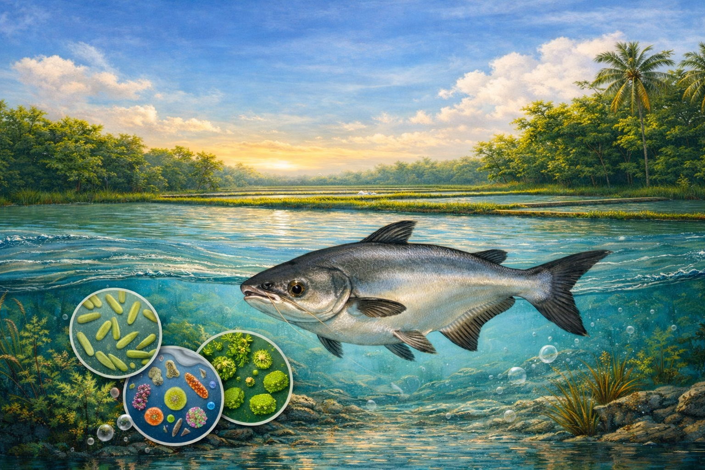
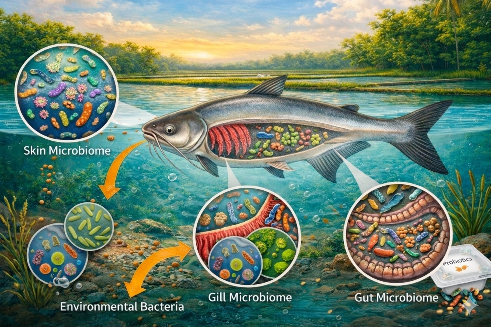

# Understanding microbial communities in aquaculture environments
::: text-justify

The term microbiome refers to the collective community of microorganisms, including bacteria, archaea, fungi, viruses, and their associated genetic material, inhabiting a defined environment and interacting dynamically with each other and with their host (Lederberg & McCray, 2001; Marchesi & Ravel, 2015). In aquatic environments, microbiomes are distributed across multiple ecological niches such as the water column, bottom sediments, biofilms on submerged surfaces, and host associated habitats including the skin, gills, and gastrointestinal tract of aquatic organisms (Thompson et al., 2017). These microbial communities play a fundamental role in maintaining ecosystem stability by driving nutrient cycling, organic matter degradation, and biogeochemical processes in aquatic systems (Falkowski et al., 2008).

In aquaculture systems, the microbiome is increasingly recognized as a key component influencing both environmental quality and host performance. Microbial communities in pond water and sediments contribute to the transformation of nitrogen, phosphorus, and organic waste, thereby directly affecting water quality and system carrying capacity (Bentzon-Tilia et al., 2016). At the host level, the gut microbiome of cultured fish supports digestion, nutrient absorption, and metabolic regulation, while also interacting closely with the immune system (Nayak, 2010; Egerton et al., 2018). Accordingly, aquaculture can be viewed as a microbiologically driven ecosystem in which microbial dynamics strongly influence production efficiency and sustainability.

The importance of the microbiome for fish health and disease resistance has been widely documented. A balanced and diverse microbiome can inhibit the proliferation of opportunistic pathogens through competitive exclusion, production of antimicrobial compounds, and stimulation of host immune responses (Verschuere et al., 2000; Ringø et al., 2016). In contrast, disturbances in microbial community structure, commonly referred to as dysbiosis, are often associated with increased disease susceptibility, reduced growth performance, and impaired immune function in cultured fish (Schryver & Vadstein, 2014; Infante-Villamil et al., 2021). As a result, monitoring and managing microbiome dynamics has emerged as a promising strategy for disease prevention and health management in intensive aquaculture systems.

Within this context, the Deltavax project aims to investigate microbiome dynamics in intensive pangasius aquaculture systems, with a particular focus on microbial communities in pond water, bottom sediments, and host-associated environments. The primary objectives of the study are to characterize the composition and variability of microbiomes using molecular approaches, to evaluate their relationships with fish health and disease occurrence, and to identify environmental and management factors that influence microbial balance in production systems. By improving the understanding of microbiome host environment interactions, this research seeks to support the development of more sustainable and health-oriented pangasius aquaculture practices.
:::

## Microbial communities in intensive pangasius aquaculture systems
:::{.text-justify}
In this study, the pond water microbiome was examined in relation to the aquaculture production system used for *Pangasius hypophthalmus*. While pangasius monoculture and polyculture ponds shared broadly similar microbial community compositions, significant differences were observed in microbial diversity and the relative abundance of specific bacterial taxa. Microbial alpha diversity was significantly higher in polyculture systems than in monoculture ponds, indicating that culture system configuration influences microbial stability. In particular, the relative abundance of bacterial phyla such as Planctomycetota, Actinomycetota, and Verrucomicrobiota was greater in polyculture ponds, suggesting enhanced functional potential for organic matter degradation and nutrient cycling. Multivariate analyses further indicated that the culture system exerted a statistically significant, albeit weaker, influence on microbial community structure compared with seasonality and geographical location. Nevertheless, a substantial proportion of bacterial ASVs was shared between monoculture and polyculture systems, indicating the presence of a stable core microbiome in pangasius pond environments (Debnath et al., 2025).

In catfish aquaculture, organic matter levels in ponds are typically high due to continuous inputs from feed and fish excreta. These inputs support diverse microbial communities that mineralize organic matter into inorganic compounds (Moriarty, 1997), some of which, such as ammonia, nitrite, and hydrogen sulphide, can be toxic at elevated concentrations (Chien, 1992). Consequently, microbial diversity and abundance play a central role in regulating water quality (Giang et al., 2008; Ut et al., 2016) and influencing the prevalence of endemic diseases (Dung et al., 2008; Diep et al., 2009; Pokhrel & Oanh, 2021). However, detailed information on bacterial community composition in catfish pond water and sediments remains limited. Characterizing these microbial communities is therefore a crucial first step toward improving water quality management and fish health in intensive catfish farming systems (Zeng et al., 2010; Bentzon-Tilia et al., 2016).
:::

### Microbial communities in pond water
:::{.text-justify}
In intensive *Pangasianodon hypophthalmus* ponds, the water column hosts a highly dynamic bacterial community that is strongly influenced by feeding practices, fish metabolism, and water exchange regimes. Proteobacteria are typically the dominant phylum in pond water, with genera such as *Aeromonas* and *Pseudomonas* frequently detected, reflecting the high organic loading derived from uneaten feed and fish excreta. These bacteria play dual roles within the system: while many taxa contribute to organic matter degradation and nutrient cycling, opportunistic pathogens such as *Aeromonas* spp. may pose significant health risks to fish under stressful environmental conditions. The composition of waterborne bacterial communities often responds rapidly to short term changes in water quality parameters, including dissolved oxygen, turbidity, and nutrient concentrations, indicating a strong link between microbial structure and environmental conditions (Truong et al., 2022). This study provided evidence that shifts in bacterial community composition can serve as indicators of environmental quality in striped catfish ponds, representing one of the first detailed characterizations of bacterial populations in pangasius ponds in the Mekong Delta.

In a related study, Mahmud et al. (2019) investigated bacterial communities in a cage-culture system of striped catfish (*Pangasius hypophthalmus*) in the Pahang River, Malaysia, and reported that cage farming in the study area was subject to significant pressure from deteriorating water quality. Elevated concentrations of iron and nitrite were identified as key environmental factors promoting the growth of *Aeromonas* spp., thereby increasing disease risk in cultured fish. Pathogenic bacteria, particularly *Aeromonas hydrophila*, accounted for up to 63% of bacterial isolates, alongside several *Pseudomonas* species, including *P. damselae*, *P. shigelloides*, and *P. fluorescens* (Mahmud et al., 2019). These findings demonstrate that river water quality directly influences microbial community structure and fish health in cage-based systems, highlighting the importance of integrated monitoring of environmental parameters and microbial dynamics to support early disease prevention strategies.
:::

### Microbial communities in pond sediment
:::{.text-justify}
Sediments in intensive pangasius ponds function as major microbial reservoirs, harboring bacterial communities that are generally more diverse and stable than those in the overlying water column. Phyla such as Bacteroidetes and Firmicutes are commonly enriched in bottom sediments due to their strong capacity to decompose accumulated organic matter, including feed residues and fecal particles. At the same time, sediments may also harbor opportunistic pathogenic bacteria, including *Aeromonas* spp., which can persist in anaerobic or low oxygen microenvironments. Because sediment-associated bacteria can be resuspended into the water column through aeration or fish activity, the benthic microbiome plays a critical role in shaping water quality and influencing fish associated microbiota. Thus, pond sediments represent both a site of organic matter degradation and a potential source of pathogenic bacteria under unfavorable environmental conditions (Truong et al., 2022).
:::

## Microbial communities in fish internal organs
:::{.text-justify}
In aquaculture research, the gut microbiome has received considerable attention due to its central role in feed utilization, growth performance, and overall productivity (Perry et al., 2020). However, microbiomes associated with the skin, gills, and surrounding water are also critical determinants of disease resistance and susceptibility (McMurtrie et al., 2022). A comprehensive understanding of fish health therefore requires an integrated examination of microbial communities across multiple host associated organs, including the gut, gills, and skin.

Bacteria present in pond water and sediments continuously interact with fish, making cultured fish highly susceptible to colonization by environmental microbes. These bacteria can influence the microbial communities of both external and internal organs, including the gills and gastrointestinal tract. In particular, bacteria present in water and feed can enter the fish through ingestion, ultimately colonizing or transiently passing through the gut (Zeng et al., 2020; Wang et al., 2019). Under stressful conditions or deteriorating water quality, some of these bacteria may act as opportunistic pathogens, increasing disease risk. Information on bacterial abundance and seasonal variation across pond water, sediments, gills, and intestines is therefore essential for identifying abnormal conditions and implementing corrective management measures (Uddin et al., 2004).

Haider et al. (2022) investigated viable bacterial counts in the gills and intestines of striped catfish collected from cultured ponds and demonstrated that bacterial loads were consistently higher in the intestines than in the gills. This finding indicates that the gastrointestinal tract functions as a major microbial reservoir in pangasius, likely due to continuous exposure to bacteria through feed intake and water ingestion. The study further emphasized the close ecological link between pond associated microbiota and fish associated microbial communities, highlighting the role of environmental bacteria in shaping the microbiomes of both external and internal fish organs.

According to Haque et al. (2022), dietary probiotic supplementation significantly improved growth performance, survival, and health status in striped catfish. Fish receiving probiotics exhibited enhanced immune responses, reflected by improved hematological parameters, and maintained a more balanced gut microbiome compared with control fish. These findings confirm the role of probiotics as a sustainable strategy for enhancing production efficiency and reducing disease risk through microbiome modulation, thereby decreasing reliance on antibiotics in intensive pangasius aquaculture.

Similarly, Vala et al. (2024) demonstrated that farming systems strongly influence gut microbiome composition in *Pangasius pangasius*. Their results revealed significantly higher microbial richness and diversity in biofloc systems compared with cage and pond systems. Dominant phyla included Firmicutes and Fusobacteriota, while genera such as *Cetobacterium* and WWE3 were consistently abundant across systems. Functional prediction analyses further indicated system-specific differences in metabolic pathways, with biofloc systems exhibiting a greater number of unique functional traits. Overall, these findings highlight the strong interaction between farming system design and gut microbiome structure, underscoring the importance of microbiome-informed management strategies in pangasius aquaculture.
:::

:::hero
  

:::
