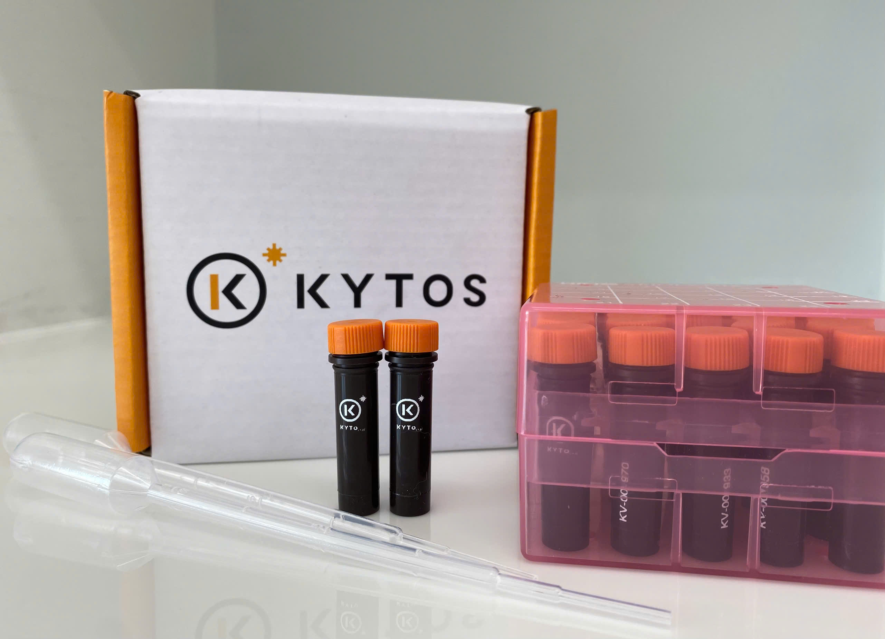

# PHARMAQ - KYTOS: Development of a bacterial detection model for pangasius ponds
:::{.text-justify}

PHARMAQ is a company specializing in the development of vaccines and disease prevention solutions for aquaculture and is part of Zoetis, a global leader in animal health. The company focuses on research, production, and delivery of vaccines, injection systems, and diagnostic solutions to support disease control and improve production efficiency in aquaculture.

Within the framework of the Deltavax project, with support from PHARMAQ, KYTOS implements a model training activity aimed at analyzing and monitoring bacteria in pond aquaculture environments. The activity focuses on processing and analyzing microbial data related to two important bacterial pathogens in pangasius farming, namely *Edwardsiella ictaluri* and *Aeromonas hydrophila*, while also developing microbial markers for the identification and monitoring of these pathogens in pond water samples. The results from the model allow tracking of microbial community dynamics over time, providing a basis for environmental assessment and monitoring in aquaculture systems.
:::

## Objective
:::{.text-justify}

The objective of the experiment is to develop and train a machine learning model based on microbial data to detect and predict the presence as well as the abundance of two important bacterial pathogens in pangasius aquaculture, including *Edwardsiella ictaluri* and *Aeromonas hydrophila*.

Through the integration of microbial analytical data with machine learning algorithms, the model is developed to enable early detection of pathogenic bacteria and support the prediction of bacterial dynamics in pond systems. The results from the model are expected to contribute to improving microbial management in water and reducing disease risks in practical aquaculture production.
:::

## Experimental Preparation

### Support from PHARMAQ:

* Provision of pure bacterial cultures (*Edwardsiella ictalur* and *Aeromonas hydrophila*) at a concentration of approximately 1 × 10⁸cells/mL

* Supply of pond water samples (500 mL) 

* Preparation of necessary equipment and laboratory materials 

* Execution of the validation experiment following the agreed protocol 

### Role of KYTOS:

* Provision of Kytovial tubes for sample collection 

* Analysis of samples using KYTOS technology 

* Development, training, and evaluation of the machine learning model 

* Technical support and coordination of experimental procedures at PHARMAQ 

{width="80%" style="margin: 0 auto; display: block;"}

## Experimental procedure

### Model training

* KYTOS provided Kytovial tubes for PHARMAQ to collect and store pure bacterial cultures. 

* Each bacterial strain was prepared in 5 mL of culture at a concentration of approximately 1 × 10⁸ cells/mL. 

* Each strain was then aliquoted into 10 Kytovial tubes (total volume: 10 mL). 

* The prepared samples were transported to the KYTOS laboratory for analysis and used as training data for the machine learning model. 

### Model validation experiment

The validation experiment was conducted at the PHARMAQ laboratory with technical support from KYTOS to evaluate the predictive performance of the model under simulated farm conditions.

### Bacterial biomass washing

* 6 mL of bacterial culture was transferred into a 10 mL centrifuge tube. 

* Samples were centrifuged at 5,000 × g for 3 minutes. 

* The supernatant was carefully removed. 

* The pellet was resuspended in 6 mL of filtered Instant Ocean solution. 

* The washing step was repeated once (total of two washes). 

### Sample fixation

* For bacterial samples: 600 µL of fixative solution was added to 6 mL of bacterial suspension and gently mixed. 

* For pond water samples: 10 mL of fixative solution was added to 100 mL of pond water and mixed thoroughly. 

* Samples were incubated for 30 minutes for fixation. 

### Initial control sampling (before spike-in)

* **Bacterial control (S0):** 1 mL of processed bacterial suspension was transferred into a Kytovial tube and gently mixed. 

* **Matrix control (M0):** 1 mL of pond water was transferred into a Kytovial tube and gently mixed. 

### Spike-in experimental setup

| Concentration (%) | Bacterisl volume (µL) | Pond water (µL) | 
|:-----------------:|:--------------------:|:---------------:|
|0           |0           |      10.000     |
|1           |100         |       9.900     |
|2           |200         |       9.800     |
|3           |300         |       9.700     |
|4           |400         |       9.600     |
|5           |500         |       9.500     |

: **Spike-in concentration series**

*	Samples were prepared at six different bacterial proportions: 0%, 1%, 2%, 3%, 4%, and 5% (v/v).

*	The total volume of each sample was fixed at 10,000 µL. 

### Procedure

*	The corresponding volume of bacterial suspension was added to pond water according to each target concentration. 

*	Samples were mixed thoroughly using a vortex mixer. 

*	Three independent replicates were prepared for each concentration level. 

*	After mixing, 1 mL from each sample was transferred into a Kytovial tube for analysis. 

### Ground-truth calculation

The actual bacterial concentration in each spike-in sample was calculated using the following equation:

$\text{Ground-truth (cells/mL)} = S_0 \times \frac{V_{\text{spike}}}{V_{\text{total}}}$

Where:

* $S_0$: bacterial concentration in the control sample (cells/mL) 

* $V_{\text{spike}}$: volume of bacterial suspension added (µL) 

* $V_{\text{total}}$: total sample volume (10,000 µL)

### Model evaluation

*	Spike-in samples were used as input for the prediction model.

*	Model outputs were compared with the calculated ground-truth values. 

*	Model performance was evaluated based on prediction accuracy and agreement with actual concentrations.

## Model training and evaluation results (to be updated)
:::{.text-justify}
The results of model training and evaluation will be presented upon completion of data analysis. The analysis will focus on assessing the model’s ability to detect and quantify the two target bacterial pathogens based on the collected microbial data.

The evaluation is expected to include the following metrics:

*	Accuracy of the model in detecting the presence of target bacteria 

*	Correlation between predicted values and ground-truth concentrations derived from spike-in samples 

*	Predictive performance across a range of bacterial concentrations 

*	Assessment of error and model reliability under different sample conditions 

In addition, the results will explore the potential application of the model for expanding microbial monitoring parameters within the KytoApp platform. The model is expected to be integrated into the analytical system to support early detection of pathogenic bacteria and provide quantitative insights for water quality monitoring in aquaculture systems.
:::

:::hero
  

:::

